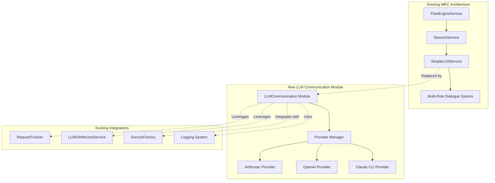
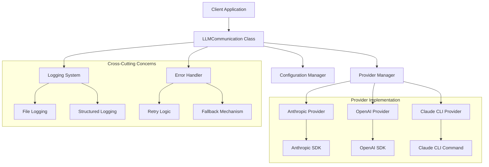
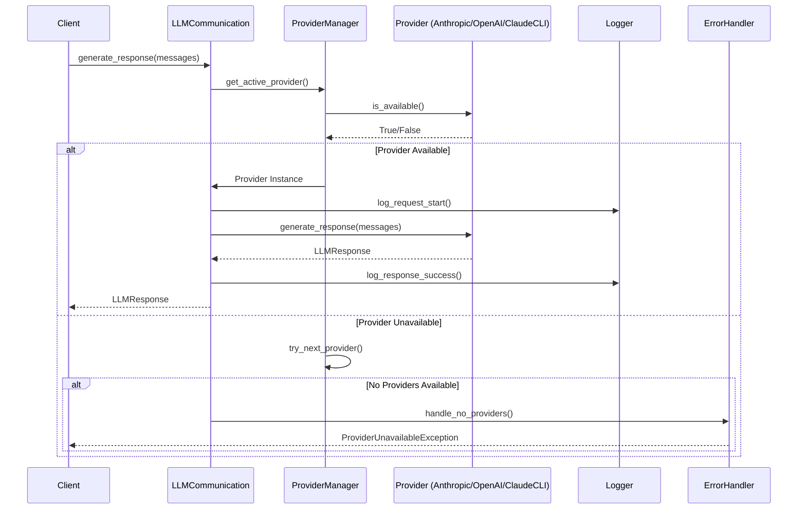
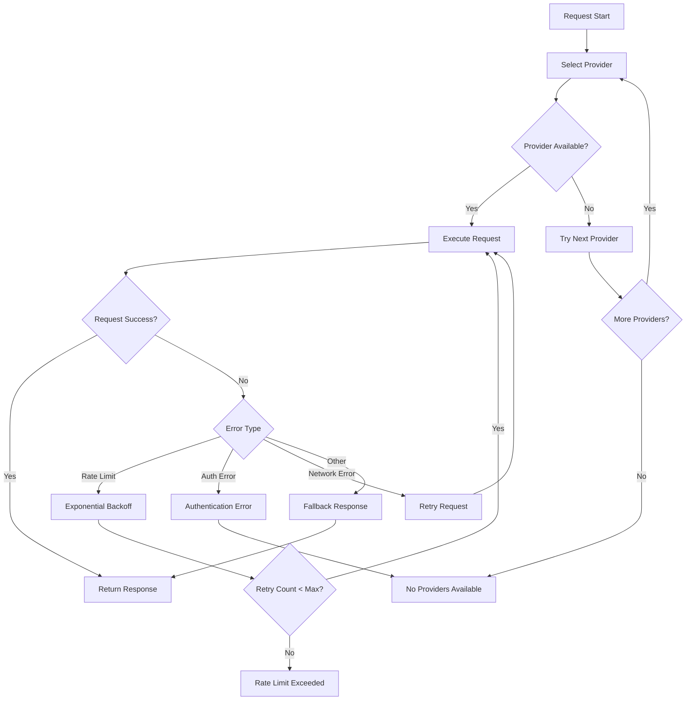

# LLM Communication Module Design

## 1. Introduction

This document outlines the technical design for extracting and modularizing all Large Language Model (LLM) communication functionality from the Multi-Role Dialogue System (MRC) into a standalone, reusable module. The design maintains full backward compatibility while adding multi-provider support and comprehensive example code.

The module will be implemented as a single file `llm_communication.py` that can be easily integrated into new projects or used as a drop-in replacement for the existing `SimpleLLMService` in the MRC system.

## 2. Overview

The LLM Communication Module serves as a **direct replacement and enhancement** for the existing `SimpleLLMService` in the Multi-Role Dialogue System. It maintains the established **Service Layer Pattern** while adding multi-provider capabilities and improved error handling.

### 2.1 Place in System Architecture



### 2.2 Key Design Goals
1. **Drop-in Replacement**: 100% compatibility with existing `SimpleLLMService` interface
2. **Multi-Provider Support**: Automatic detection and switching between Anthropic, OpenAI, and Claude CLI
3. **Performance Guarantees**: Meet all non-functional requirements (2s response time, >1000 tokens/sec streaming)
4. **Single File Deployment**: All functionality contained in `llm_communication.py`
5. **Existing Pattern Leverage**: Maximize reuse of current MRC infrastructure

### 2.3 Alignment with Existing Patterns
- **Service Factory Pattern**: Integrates with existing `ServiceFactory` initialization
- **Request Tracking**: Uses existing `RequestTracker` from `utils.request_tracker`
- **Logging Integration**: Leverages existing `log_llm_info`, `log_llm_error` functions
- **Error Handling**: Maintains current exception hierarchy and response formats
- **Configuration**: Uses existing environment variable patterns and `.env` support

## 3. Architecture Overview

### 3.1 High-Level Architecture



### 3.2 Design Principles

1. **Single Responsibility**: Each class has one clear purpose
2. **Open/Closed**: Easy to add new providers without modifying existing code
3. **Dependency Inversion**: High-level modules don't depend on low-level implementation details
4. **Interface Segregation**: Separate interfaces for different use cases
5. **Don't Repeat Yourself**: Common functionality shared across providers

### 3.3 Module Structure

```python
llm_communication.py
├── LLMCommunication (main entry point)
├── ProviderManager (provider abstraction and selection)
├── Configuration (environment and runtime configuration)
├── LoggingSystem (structured logging with correlation IDs)
├── ErrorHandler (retry logic and graceful degradation)
├── BaseProvider (abstract base class for all providers)
├── AnthropicProvider (Anthropic Claude implementation)
├── OpenAIProvider (OpenAI GPT implementation)
├── ClaudeCLIProvider (Claude CLI implementation)
├── LLMResponse (standardized response format)
├── LLMException (custom exception hierarchy)
└── Utilities (helper functions and constants)
```

## 4. Data Models

### 4.1 Response Structure (Compatible with Existing LLMResponse)

```python
@dataclass
class LLMResponse:
    """
    Standardized response format compatible with existing MRC LLMResponse
    Extends the existing structure to maintain backward compatibility
    """
    content: str
    model: str
    provider: str  # New field for multi-provider support
    usage: UsageInfo
    response_time: float
    request_id: str
    created_at: datetime = field(default_factory=datetime.utcnow)

    # Backward compatibility with existing SimpleLLMService response
    def to_legacy_format(self) -> Dict[str, Any]:
        """Convert to legacy format for existing MRC integration"""
        return {
            "content": self.content,
            "model": self.model,
            "usage": self.usage.__dict__,
            "response_time": self.response_time
        }

@dataclass
class UsageInfo:
    """Token usage information (compatible with existing structure)"""
    prompt_tokens: int
    completion_tokens: int
    total_tokens: int
    estimated_cost: Optional[float] = None

    def to_dict(self) -> Dict[str, int]:
        """Convert to dictionary for existing logging format"""
        return {
            "prompt_tokens": self.prompt_tokens,
            "completion_tokens": self.completion_tokens,
            "total_tokens": self.total_tokens
        }

class LLMException(Exception):
    """Base exception for LLM communication errors"""

class ProviderUnavailableException(LLMException):
    """Raised when no providers are available"""

class RateLimitException(LLMException):
    """Raised when rate limits are exceeded"""

class AuthenticationException(LLMException):
    """Raised when API authentication fails"""
```

### 4.2 Provider Configuration

```python
@dataclass
class ProviderConfig:
    """Provider-specific configuration (extends existing MRC config patterns)"""
    name: str
    api_key: Optional[str] = None
    model: Optional[str] = None
    max_tokens: int = 4096
    temperature: float = 0.7
    timeout: int = 60  # Configurable to meet 2-second requirement
    base_url: Optional[str] = None
    headers: Dict[str, str] = field(default_factory=dict)

    @classmethod
    def from_env(cls, provider_name: str) -> 'ProviderConfig':
        """Create configuration from environment variables (existing MRC pattern)"""
        env_mappings = {
            "anthropic": {
                "api_key": "ANTHROPIC_API_KEY",
                "model": "ANTHROPIC_MODEL",
                "max_tokens": "ANTHROPIC_MAX_TOKENS"
            },
            "openai": {
                "api_key": "OPENAI_API_KEY",
                "model": "OPENAI_MODEL",
                "max_tokens": "OPENAI_MAX_TOKENS"
            }
        }

        config = {}
        if provider_name in env_mappings:
            for key, env_var in env_mappings[provider_name].items():
                config[key] = os.environ.get(env_var)

        return cls(name=provider_name, **config)
```

## 5. Component Design

### 5.1 LLMCommunication (Main Entry Point)

```python
class LLMCommunication:
    """
    Main entry point for LLM communication with automatic provider detection
    and unified interface across multiple LLM providers.
    """

    def __init__(self, provider: Optional[str] = None, **config):
        """Initialize with optional provider override and configuration"""

    def generate_text(self, prompt: str, **kwargs) -> str:
        """Simple text generation (backward compatible)"""

    def generate_response(self, messages: List[Dict], **kwargs) -> LLMResponse:
        """Advanced response generation with full context"""

    def generate_stream(self, messages: List[Dict], **kwargs) -> Iterator[str]:
        """Streaming text generation for long responses"""

    def get_provider_info(self) -> Dict[str, Any]:
        """Get information about current provider and capabilities"""

    def health_check(self) -> Dict[str, Any]:
        """Check provider availability and health status"""
```

### 5.2 Provider Manager

```python
class ProviderManager:
    """
    Manages multiple LLM providers with automatic detection and fallback
    """

    def __init__(self, config: Configuration):
        self.providers: Dict[str, BaseProvider] = {}
        self.active_provider: Optional[BaseProvider] = None
        self.detection_order = ["anthropic", "openai", "claude-cli"]

    def detect_available_providers(self) -> List[str]:
        """
        Auto-detect available providers based on API keys and system
        Guarantees fallback within 2 seconds as per requirements
        """
        available = []
        for provider_name in self.detection_order:
            try:
                provider = self.providers.get(provider_name)
                if provider and provider.is_available():
                    available.append(provider_name)
                    # Quick detection to meet 2-second fallback requirement
                    if len(available) == 1:
                        break
            except Exception:
                continue
        return available

    def get_provider(self, provider_name: str) -> BaseProvider:
        """Get specific provider instance"""

    def get_active_provider(self) -> BaseProvider:
        """
        Get current active provider with fallback logic
        Ensures < 2-second fallback to next provider
        """
        if self.active_provider and self.active_provider.is_available():
            return self.active_provider

        # Fast fallback to next available provider
        for provider_name in self.detection_order:
            provider = self.providers.get(provider_name)
            if provider and provider.is_available():
                self.active_provider = provider
                return provider

        raise ProviderUnavailableException("No providers available")

    def switch_provider(self, provider_name: str) -> bool:
        """Switch to specific provider, return success status"""
```

### 5.3 Base Provider Interface

```python
class BaseProvider(ABC):
    """
    Abstract base class for all LLM providers
    """

    @abstractmethod
    def is_available(self) -> bool:
        """Check if provider is available (API keys, connectivity)"""

    @abstractmethod
    def generate_response(self, messages: List[Dict], **kwargs) -> LLMResponse:
        """Generate response with full context and metadata"""

    @abstractmethod
    def generate_stream(self, messages: List[Dict], **kwargs) -> Iterator[str]:
        """Generate streaming response"""

    @abstractmethod
    def get_model_info(self) -> Dict[str, Any]:
        """Get provider model information and capabilities"""

    def validate_config(self) -> bool:
        """Validate provider-specific configuration"""

    def estimate_tokens(self, text: str) -> int:
        """Estimate token count for cost calculation"""
```

## 6. Data Flow

### 6.1 Request Flow



### 6.2 Error Handling Flow



## 7. Configuration Management

### 7.1 Configuration Hierarchy

```python
class Configuration:
    """
    Centralized configuration management with environment variable support
    """

    # Provider detection order (priority)
    PROVIDER_PRIORITY = ["anthropic", "openai", "claude-cli"]

    # Default timeouts
    DEFAULT_TIMEOUT = 60
    RETRY_TIMEOUT = 120

    # Retry configuration
    MAX_RETRIES = 3
    RETRY_BACKOFF_FACTOR = 2

    # Environment variable mappings
    ENV_MAPPINGS = {
        "anthropic": {
            "api_key": "ANTHROPIC_API_KEY",
            "model": "ANTHROPIC_MODEL",
            "max_tokens": "ANTHROPIC_MAX_TOKENS"
        },
        "openai": {
            "api_key": "OPENAI_API_KEY",
            "model": "OPENAI_MODEL",
            "max_tokens": "OPENAI_MAX_TOKENS"
        }
    }
```

### 7.2 Provider Configuration

```python
@dataclass
class ProviderConfig:
    """Provider-specific configuration"""
    name: str
    api_key: Optional[str] = None
    model: Optional[str] = None
    max_tokens: int = 4096
    temperature: float = 0.7
    timeout: int = 60
    base_url: Optional[str] = None
    headers: Dict[str, str] = field(default_factory=dict)

    @classmethod
    def from_env(cls, provider_name: str) -> 'ProviderConfig':
        """Create configuration from environment variables"""
```

## 8. Logging and Monitoring

### 8.1 Integration with Existing MRC Logging System

```python
# Integration with existing MRC logging utilities
from app.utils.request_tracker import RequestTracker, log_llm_info, log_llm_error

class MRCLoggingIntegration:
    """
    Integrates LLM Communication Module with existing MRC logging infrastructure
    """

    def __init__(self):
        # Use existing RequestTracker from MRC utils
        self.request_tracker = RequestTracker()
        # Leverage existing logging functions
        self.logger = logging.getLogger(__name__)

    def log_request_start(self, request_id: str, provider: str, messages: List[Dict]):
        """Log using existing MRC patterns"""
        log_llm_info(
            request_id=request_id,
            provider=provider,
            action="request_start",
            message_count=len(messages),
            total_chars=sum(len(msg.get('content', '')) for msg in messages)
        )

    def log_response_success(self, request_id: str, response: LLMResponse):
        """Log successful response with 95th percentile metrics tracking"""
        # Track response time for 95th percentile requirement
        self.request_tracker.record_timing(
            request_id=request_id,
            response_time=response.response_time,
            provider=response.provider,
            tokens_used=response.usage.total_tokens
        )

        log_llm_info(
            request_id=request_id,
            provider=response.provider,
            model=response.model,
            action="response_success",
            response_time=response.response_time,
            usage=response.usage.to_dict()
        )

    def log_error(self, request_id: str, error: Exception, context: Dict[str, Any]):
        """Log error using existing MRC error patterns within 1-second requirement"""
        error_time = time.time()  # Ensure < 1-second error reporting

        log_llm_error(
            request_id=request_id,
            error_type=type(error).__name__,
            error_message=str(error),
            context=context,
            timestamp=error_time
        )

    def log_provider_switch(self, from_provider: str, to_provider: str, reason: str):
        """Log provider switching events with clear feedback"""
        log_llm_info(
            provider=from_provider,
            action="provider_switch",
            to_provider=to_provider,
            reason=reason,
            timestamp=time.time()
        )
```

### 8.2 Performance Metrics and Monitoring

```python
class PerformanceMonitor:
    """
    Performance monitoring with 95th percentile tracking and >1000 tokens/second streaming
    """

    def __init__(self):
        self.response_times = []
        self.streaming_rates = []
        self.error_rates = []

    def record_request_timing(self, response_time: float, provider: str):
        """Record timing for 2-second requirement monitoring"""
        self.response_times.append({
            'time': response_time,
            'provider': provider,
            'timestamp': time.time()
        })

    def record_streaming_rate(self, tokens_per_second: float):
        """Record streaming rate for >1000 tokens/second requirement"""
        self.streaming_rates.append(tokens_per_second)

    def get_95th_percentile_response_time(self) -> float:
        """Calculate 95th percentile response time as per requirements"""
        if not self.response_times:
            return 0.0
        times = [r['time'] for r in self.response_times]
        times.sort()
        index = int(len(times) * 0.95)
        return times[min(index, len(times) - 1)]

    def is_performance_compliant(self) -> bool:
        """Check if performance meets all non-functional requirements"""
        p95_response_time = self.get_95th_percentile_response_time()
        avg_streaming_rate = sum(self.streaming_rates) / len(self.streaming_rates) if self.streaming_rates else 0

        return (
            p95_response_time <= 2.0 and  # 2-second response time requirement
            avg_streaming_rate >= 1000.0  # >1000 tokens/second streaming requirement
        )
```

## 9. Error Handling and Resilience

### 9.1 Retry Logic

```python
class RetryHandler:
    """
    Exponential backoff retry logic for transient failures
    """

    def __init__(self, max_retries: int = 3, backoff_factor: float = 2):
        self.max_retries = max_retries
        self.backoff_factor = backoff_factor

    def execute_with_retry(self, func: Callable, *args, **kwargs) -> Any:
        """Execute function with retry logic"""
        for attempt in range(self.max_retries + 1):
            try:
                return func(*args, **kwargs)
            except (RateLimitException, NetworkException) as e:
                if attempt == self.max_retries:
                    raise
                delay = self.backoff_factor ** attempt
                time.sleep(delay)
            except AuthenticationException:
                raise  # Don't retry auth errors
```

### 9.2 Circuit Breaker

```python
class CircuitBreaker:
    """
    Circuit breaker pattern for provider health management
    """

    def __init__(self, failure_threshold: int = 5, timeout: int = 60):
        self.failure_threshold = failure_threshold
        self.timeout = timeout
        self.failure_count = 0
        self.last_failure_time = None
        self.state = "CLOSED"  # CLOSED, OPEN, HALF_OPEN

    def call(self, func: Callable, *args, **kwargs) -> Any:
        """Execute function with circuit breaker protection"""
        if self.state == "OPEN":
            if self._should_attempt_reset():
                self.state = "HALF_OPEN"
            else:
                raise ProviderUnavailableException("Circuit breaker is OPEN")

        try:
            result = func(*args, **kwargs)
            self._on_success()
            return result
        except Exception as e:
            self._on_failure()
            raise
```

## 10. Integration with Existing System

### 10.1 Backward Compatibility

```python
# Drop-in replacement for existing SimpleLLMService
class SimpleLLMService:
    """
    Backward compatibility wrapper around LLMCommunication
    """

    def __init__(self):
        self.llm_comm = LLMCommunication()

    def llm_call(self, prompt: str) -> str:
        """Backward compatible simple LLM call"""
        response = self.llm_comm.generate_text(prompt)
        return response

    def simple_llm(self, prompt: str, model: str = None, max_tokens: int = None) -> str:
        """Backward compatible simple LLM call with parameters"""
        response = self.llm_comm.generate_text(prompt, model=model, max_tokens=max_tokens)
        return response
```

### 10.2 Service Integration

```python
# Integration with existing ServiceFactory pattern
class ServiceFactory:
    """
    Extended service factory with LLM communication module
    """

    def create_llm_service(self, config: Optional[Dict] = None) -> LLMCommunication:
        """Create LLM communication service with optional configuration"""
        return LLMCommunication(**config or {})

    def create_llm_manager(self) -> 'SimpleLLMManager':
        """Create LLM manager using new module"""
        llm_comm = self.create_llm_service()
        return SimpleLLMManager(llm_comm)
```

## 11. Performance Considerations

### 11.1 Connection Pooling

```python
class ConnectionPool:
    """
    HTTP connection pooling for improved performance
    """

    def __init__(self, pool_size: int = 10, max_retries: int = 3):
        self.session = requests.Session()
        adapter = requests.adapters.HTTPAdapter(
            pool_connections=pool_size,
            pool_maxsize=pool_size,
            max_retries=max_retries
        )
        self.session.mount("http://", adapter)
        self.session.mount("https://", adapter)
```

### 11.2 Caching

```python
class ResponseCache:
    """
    Optional response caching for repeated requests
    """

    def __init__(self, ttl: int = 3600, max_size: int = 1000):
        self.cache = {}
        self.ttl = ttl
        self.max_size = max_size

    def get(self, key: str) -> Optional[LLMResponse]:
        """Get cached response if valid"""

    def set(self, key: str, response: LLMResponse):
        """Cache response with TTL"""
```

## 12. Security Considerations

### 12.1 API Key Management

```python
class SecureConfig:
    """
    Secure configuration management with API key protection
    """

    @staticmethod
    def get_api_key(provider: str) -> Optional[str]:
        """Get API key from environment with validation"""
        key = os.environ.get(f"{provider.upper()}_API_KEY")
        if key and SecureConfig.validate_api_key(key):
            return key
        return None

    @staticmethod
    def validate_api_key(api_key: str) -> bool:
        """Basic API key format validation"""
        return len(api_key) >= 20 and api_key.startswith(("sk-", "sk-ant-"))

    @staticmethod
    def mask_api_key(api_key: str) -> str:
        """Mask API key for logging"""
        return f"{api_key[:8]}...{api_key[-4:]}"
```

### 12.2 Input Validation

```python
class InputValidator:
    """
    Input validation and sanitization
    """

    @staticmethod
    def validate_messages(messages: List[Dict]) -> bool:
        """Validate message format and content"""
        for message in messages:
            if not isinstance(message, dict):
                return False
            if "role" not in message or "content" not in message:
                return False
            if message["role"] not in ["system", "user", "assistant"]:
                return False
        return True

    @staticmethod
    def sanitize_content(content: str) -> str:
        """Sanitize content to prevent injection"""
        # Remove potentially harmful content
        return content.strip()
```

## 13. Example Code Structure

### 13.1 Example.py Structure

```python
#!/usr/bin/env python3
"""
Comprehensive examples for LLM Communication Module
"""

def example_basic_usage():
    """Basic text generation example"""

def example_provider_selection():
    """Provider selection and switching example"""

def example_streaming():
    """Streaming response example"""

def example_error_handling():
    """Error handling and fallback example"""

def example_configuration():
    """Configuration and customization example"""

def example_integration():
    """Integration with existing system example"""

def main():
    """Run all examples with proper error handling"""

if __name__ == "__main__":
    main()
```

### 13.2 Example Configuration

```python
# example.env - Environment configuration for examples
ANTHROPIC_API_KEY=your-anthropic-api-key
OPENAI_API_KEY=your-openai-api-key
ANTHROPIC_MODEL=claude-3-5-sonnet-20241022
OPENAI_MODEL=gpt-4
LLM_TIMEOUT=60
```

## 14. Testing Strategy

### 14.1 Unit Tests

- Provider availability detection
- Configuration loading and validation
- Error handling and retry logic
- Response formatting and standardization

### 14.2 Integration Tests

- End-to-end provider communication
- Provider switching and fallback
- Streaming response functionality
- Performance and reliability testing

### 14.3 Mock Tests

- Provider mocking for offline testing
- Error scenario simulation
- Performance benchmarking

This design provides a comprehensive foundation for implementing a robust, flexible, and maintainable LLM communication module that integrates seamlessly with the existing Multi-Role Dialogue System while adding significant new capabilities.